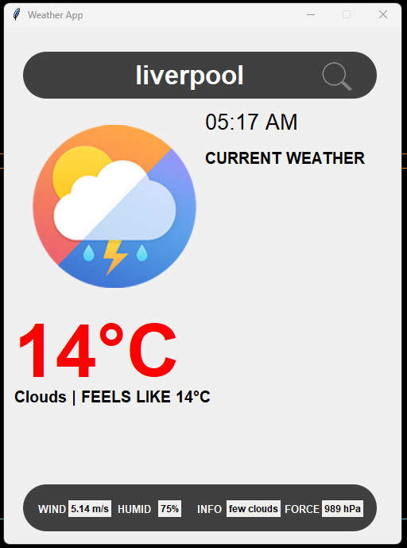

# Weather App

## Description

The Weather App is a Python program that allows users to retrieve current weather information for a specific city. It provides real-time data such as temperature, weather condition, humidity, wind speed, and more. The app uses the OpenWeatherMap API to fetch weather data and display it in a user-friendly graphical interface.

## Features

- User-friendly graphical interface.
- Real-time weather data retrieval.
- Display of temperature, weather condition, and additional information.
- Automatic timezone detection based on the selected city.

## Installation

1. Clone this repository to your local machine:

   ```bash
   git clone https://github.com/yourusername/weather-app.git
   ```

2. Install the required Python packages:

   ```bash
   pip install geopy timezonefinder requests pytz
   ```

3. Obtain an API key from [OpenWeatherMap](https://openweathermap.org) by following their registration process.

4. Replace `'YOUR_API_KEY'` in the `getWeather` function with your actual OpenWeatherMap API key.

## Usage

1. Run the Weather App by executing the following command:

   ```bash
   python weather.py
   ```

2. Enter the name of the city for which you want to retrieve weather information.

3. Click the search icon or press Enter to fetch the weather data.

4. The app will display real-time weather information for the specified city.

## Screenshots



## Credits

- [OpenWeatherMap](https://openweathermap.org) - Weather data API provider.
- [Geopy](https://geopy.readthedocs.io) - Geocoding library.
- [Timezonefinder](https://pypi.org/project/timezonefinder) - Timezone detection library.
